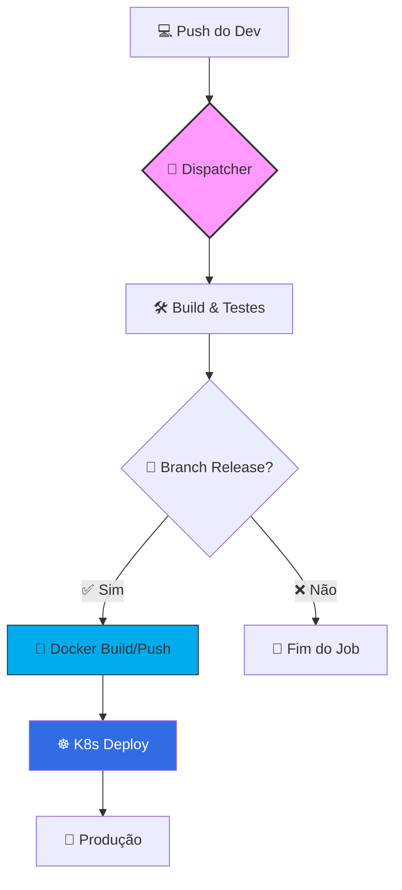

# 🚀 Pipeline CI/CD Shared (.NET & Kubernetes)


Este repositório centraliza e padroniza a lógica de **Integração e Entrega Contínua (CI/CD)** para as aplicações da organização. Através de workflows compartilhados, garantimos que todas as APIs sigam o mesmo rigor de testes, build e deploy.

---

## 🏗️ Arquitetura do Fluxo

O pipeline é orquestrado de forma modular para permitir manutenibilidade e escalabilidade.



---

## 📋 Sequência de Execução

1.  **Gatilho Interno:** O desenvolvedor configura o repositório da aplicação para chamar o `app-dispatcher.yml`.
2.  **Dispatcher (`app-dispatcher.yml`):** Funciona como o "cérebro", decidindo qual etapa rodar a seguir.
3.  **Build & Quality (`shared-k8s-docker.yml`):** Realiza o `restore`, `build` e `dotnet test`.
4.  **Entrega (Docker):** Somente em branches de `release`, a imagem é gerada e enviada ao Registry.
5.  **Implantação (`deploy-k8s.yml`):** Consome o template `dotnetapi-deployment.yaml` e atualiza o cluster.

---

## 🛠️ Como Utilizar

Adicione o seguinte arquivo em `.github/workflows/deploy.yml` no seu repositório de API:

```yaml
jobs:
  ci-cd:
    uses: organizacao/pipeline-net-core/.github/workflows/app-dispatcher.yml@main
    with:
      nome_projeto: "MinhaApi"
      nome_csproj: "MinhaApi.Web"
      nome_csproj_tests: "MinhaApi.Tests"
      nome_imagem: "minha-api-docker"
      porta_pod: 80
```

### ⚙️ Parâmetros Disponíveis

| Parâmetro | Descrição | Obrigatório |
| :--- | :--- | :---: |
| `nome_projeto` | Identificador único do artefato | Sim |
| `nome_csproj` | Nome do arquivo .csproj principal | Sim |
| `nome_csproj_tests` | Nome do arquivo .csproj de testes | Sim |
| `nome_imagem` | Nome final da imagem Docker | Sim |
| `porta_pod` | Porta que o Service do K8s irá expor | Sim |

---

## 🖥️ Requisitos do Runner (Self-Hosted)

Para o funcionamento correto, o Windows Runner deve possuir:

*   ✅ **.NET 8 SDK**
*   ✅ **Docker Desktop** (com permissão de push)
*   ✅ **Kubectl** (conectado ao cluster via Context)
*   ✅ **Variáveis de Ambiente:** `DOCKER_REGISTRY_USER`, `AZURE_CLIENT_ID`, `AZURE_TENANT_ID`, `AZURE_CLIENT_SECRET`.

---

## 💻 Idealizadores do projeto (Discord name)

| Nome | Discord |
| :--- | :--- |
| 👨‍💻 **Clovis Alceu Cassaro** | `cloves_93258` |
| 👨‍💻 **Gabriel Santos Ramos** | `_gsramos` |
| 👨‍💻 **Júlio César de Carvalho** | `cesarsoft` |
| 👨‍💻 **Marco Antonio Araujo** | `_marcoaz` |
| 👩‍💻 **Yasmim Muniz Da Silva Caraça** | `yasmimcaraca` |
